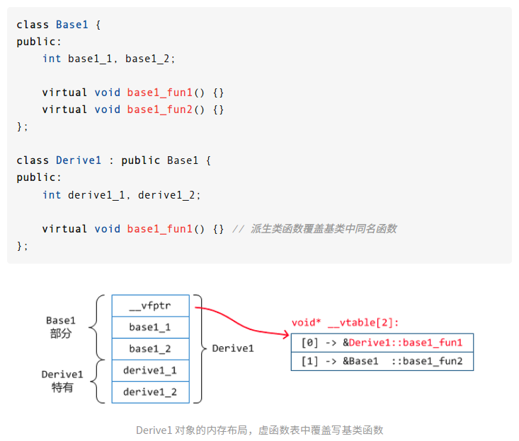

# RAII 机制的拓展用法：实现 defer

## defer 的作用和效果
defer 是一种程序流程控制机制，跟 if..else while switch..case 等关键字属于同一类别的东西。

defer 的作用是在程序执行即将离开一个作用域之前，执行一段自定义的逻辑。

观察下面的 go 语言代码：
``` golang
func SayHallo() {
    fmt.Println("hallo")
    defer func() {
        fmt.Println("defer")
    }
    fmt.Println("hallo")
}
```
<details>
<summary>程序运行结果</summary>
<pre>
hallo
hallo
defer   
</pre>
</details>

---

在 c++ 中同样有办法实现相同的流程控制机制，使用代码如下:
```c++
void SayHallo()
{
    std::cout << "hello" << std::endl;
    DEFER
    {
        std::cout << "defer" << std::endl;
    };
    std::cout << "hello" << std::endl;
}
```
本文的主要内容就是讲解如何实现这个功能。

## 为什么需要 defer
defer 的主要作用之一是简化资源释放回收的代码，降低编写代码的脑力成本。

下面是一段文件操作的伪代码：
```c++
Result ReadFile()
{
    int32_t fd = open("xxx");
    ...
    if (...)
    {
        ...
        close(fd);
        return xxx;
    }
    ...
    if (...)
    {
        ...
        close(fd);
        return xxx;
    }
    ...
    if (...)
    {
        ...
        close(fd);
        return xxx;
    }
    ...
}
```
函数 ReadFile() 会打开一个文件并读取解析文件的内容，函数内存在多处 return 返回读取的结果，每个 return 前都需要手动关闭文件，避免资源泄漏。这类多处 return 的代码就是制造的 bug 温床。   
代码量太大，逻辑太绕，都有可能让维护代码的人大脑宕机，遗漏了必要的 close() 调用，导致资源泄漏，程序朝着非预期的方向运行。

如果有 defer，上面的代码就能改成下面的样子：
```c++
Result ReadFile()
{
    int32_t fd = open("xxx");
    // 使用 defer，在离开作用域前调用 close()
    DEFER
    {
        close(fd);
    };
    ...
    if (...)
    {
        ...
        return xxx;
    }
    ...
}
```
整个函数只需要写一次 close()，无论有多少个 return，都能保证离开作用域前自动调用 close()。

## 什么是 RAII（Resource Acquisition Is Initialization）
RAII 是拥有析构函数的编程语言特有的一种惯用法，在 c++ 标准库中大量应用了这一方法。   
最著名的必须是 std::unique_ptr 等智能指针了，智能指针构造时分配内存，析构时回收内存，避免直接去用对开发人员有一定脑力负担的 new/delete 分配回收内存。   
类似的还有，std::fstream 构造时打开文件，析构时关闭文件。std::lock_guard 构造时上锁，析构时解锁。

从上面的几个例子应该能看出 RAII 这一惯用法的核心思想，用一个类去管理系统资源，当这个类初始化时向系统申请特定的资源，在析构时将资源归还系统。   
资源管理类本身是有一定要求的，实例必须是分配在栈空间上，生命周期明确，能够自动回收并调用析构函数。   
RAII 是 c++ 中最简单的资源管理方法，更多的细节和定义可以自行查阅文章末尾参考部分链接 **[1]** 的文档。   

RAII 配合上 c++11 引入的左值引用、右值引用和移动语义等机制，可以派生出抽象层级更高的所有权机制，用于更灵活更复杂的资源管理。

## 实现一个最简单的 defer
一个最简单的 Defer class 的实现，就是在构造时初始化一个 std::function 实例，在析构时执行。   
这也是为什么说 defer 是 RAII 的拓展用法的原因，因为 defer 并不是严格符合 RAII 语义的，RAII 的定义是初始化时获取资源，析构时释放资源。   

代码如下：
```c++ 
class Defer
{
public:
    /// Defer 构造时接收一个任意可调用类型的实例，
    /// 存到类型为 std::function 的 func_ 里
    Defer(std::function<void()> func)
        : func_(func) {}

    /// 析构时调用 func_
    ~Defer()
    {
        func_();
    }

private:
    /// 保存 Defer 析构时需要执行的代码
    std::function<void()> func_;
};
```
从上面的代码可以看出，Defer class 的实现是非常简单的，仅仅是保存一个函数到 std::function 里，当 Defer 实例析构时调用这个函数。   

使用代码如下：
```c++
int main(int, const char **)
{
    std::cout << "hello" << std::endl;

    // 创建一个 lambda，传递给 Defer 的构造函数
    auto defer_operator = []()
    {
        std::cout << "defer" << std::endl;
    };
    Defer defer{defer_operator};

    std::cout << "hello" << std::endl;
}
```
第一版的 Defer class 虽然实现很简单，但用起来并不是那么方便，如果同一作用域内需要多个 defer，还要手动给他们设置不同的变量名。    
下一章节将会讲解如何利用运算符重载和宏实现语法糖，简化 defer 的使用。

## 使用运算符重载和宏实现语法糖
先来看看期望的用运算符重载创建一个 Defer 实例是什么样的：
```c++
auto defer = CreateDefer{} << [&]()
{
    std::cout << "defer" << std::endl;
};
```
上面的代码中重载了二元运算符 operator<<，左侧是一个 CreateDefer 实例，右侧是一个 lambda 表达式，运算符会返回一个 Defer 实例。

要实现这样的代码，只需要再提供两个东西，一个是没有任何内容的空类 CreateDefer class，另一个是重载 operator<< 的实现。
```c++
/// 空类，用于辅助运算符重载
class CreateDefer{};

Defer operator<<(CreateDefer, std::function<void()> func)
{
    return Defer{func};
}
```
重载的 operator<< 的第一个参数不需要形参名，接收一个 CreateDefer 实例只是为了能够调用到这个运算符重载的实现。   
重载的实现简单构造返回一个 Defer 实例就行了。   

有了上面几行代码，下一步需要做的就是用宏生成 `auto defer = CreateDefer{} << [&]()` 部分的代码。   
这一部分代码不能用宏简单替换，如果在同一作用域内写了超过两个 `DEFER { ... };`，会出现重复定义同名变量的编译错误，所以必须要能够生成唯一的变量名。   
``` c++
...
#define DEFER auto defer = CreateDefer{} << [&]()
...
DEFER {};
// 第二次使用时会报重复定义 defer 这个名称
DEFER {};
```
这里用的是 `__COUNTER__` 来保证唯一性，这个宏每被展开一次，其内容都会自增。   
多次使用 DEFER 生成的变量名应该是类似 "__defer_0" "__defer_1" 这这样的。   
全部的宏定义的写法如下：
```c++
// 拼接符号名
#define CAT_SYMBOL(a, b) a##b
// 辅助展开宏变量 __COUNTER__
#define __CREATE_DEFER_NAME(a, b) CAT_SYMBOL(a, b)
// 拼接 __defer_ 和 __COUNTER__ 的内容，组成新的变量名
// 生成的变量名会是 __defer_0 __defer_1 __defer_2 ... 
#define CREATE_DEFER_NAME __CREATE_DEFER_NAME(__defer_, __COUNTER__)
// 最后再用 CREATE_DEFER_NAME 生成变量名
#define DEFER auto CREATE_DEFER_NAME = CreateDefer{} << [&]()
```
有了上面四行宏定义后，就能做到文章开头的语法效果了。
```c++
void SayHallo()
{
    std::cout << "hello" << std::endl;
    DEFER
    {
        std::cout << "defer" << std::endl;
    };
    std::cout << "hello" << std::endl;
}
```
上面四行宏定义中，拼接变量名的过程多了一个 `__CREATE_DEFER_NAME` 作为中间层，为什么需要这样的中间层，这就涉及到了 c 语言宏展开的结束条件。   
宏展开的结束条件有 4 个：   
（一）最普通的，已经没有任何宏符号了，不需要再继续展开   
（二）下一步是转换字符串   
（三）下一步是符号拼接   
（四）出现直接或间接的递归   

需要 `__CREATE_DEFER_NAME` 就是因为出现了上述的情况（三），宏 `CAT_SYMBOL` 用于符号拼接，如果没有 `__CREATE_DEFER_NAME`，宏展开过程将会是这样的：
```c++
// 宏定义
#define CAT_SYMBOL(a, b) a##b
#define CREATE_DEFER_NAME CAT_SYMBOL(__defer_, __COUNTER__)

// CREATE_DEFER_NAME 的展开流程
CREATE_DEFER_NAME

        |
        v

CAT_SYMBOL(__defer_, __COUNTER__)

        |
        v

__defer_##__COUNTER__

        |
        v

__defer___COUNTER__
```
由于在宏 `CAT_SYMBOL` 展开后出现了符号拼接操作，展开结束，最后完成符号拼接操作将 `__defer_` 和 `__COUNTER__` 组合在一起，整个预处理就算完成了。   
最终展开的结果是 "\_\_defer\_\_\_COUNTER\_\_" 肯定不是我们想要的，这样跟直接写死 "defer" 没有任何区别。   

所以才需要多一个在中间多插入一个宏，帮助 `__COUNTER__` 完成展开，在去进行符号拼接。过程如下：
```c++
// 宏定义
#define CAT_SYMBOL(a, b) a##b
#define __CREATE_DEFER_NAME(a, b) CAT_SYMBOL(a, b)
#define CREATE_DEFER_NAME __CREATE_DEFER_NAME(__defer_, __COUNTER__)

// CREATE_DEFER_NAME 的展开流程
CREATE_DEFER_NAME

        |
        v

__CREATE_DEFER_NAME(__defer_, __COUNTER__)

        |
        v

__CREATE_DEFER_NAME(__defer_, 0)

        |
        v

CAT_SYMBOL(__defer_, 0)

        |
        v

__defer_##0

        |
        v

__defer_0
```
有了 `__CREATE_DEFER_NAME` 后，才能避免 `__COUNTER__` 直接进入符号拼接，从而有机会被展开成为实际的值。   
在第一次用 DEFER 的使用会生成符号 "__defer_0"，第二次时生成 "__defer_1"，以此类推。

## 使用模板消除非必要的运行时开销
空口无凭，下面直接通过编译器编译输出的汇编指令，看看优化到底有没有效果。   
编译参数都是 `-std=c++17 -O3`   
优化前：https://godbolt.org/z/Tf4n44qe3   
优化后：https://godbolt.org/z/3xT9jEznn   

优化前后最明显的差别就是汇编指令的数量了，优化前有 150+ 行的汇编指令，而优化后只有 40+ 行。    
当然了程序性能是不能用代码行数来评判的，更多的是需要实际分析和做基准测试去对比。   
优化前的汇编指令里能看到大量的寻址操作和对地址进行调用操作，而优化后的汇编没有一条指令是多余的，干净利落直截了当。    

现在有两个疑问。    

**优化前为什么会出现这么多寻址和调用，这些指令都是干什么的？**

**优化后为什么连 Defer class 的构造函数析构函数调用都消失了？**

两份代码的唯一差别就是有没有用到 std::function，产生这些汇编指令的肯定就是 std::function 了，想要解释上面的问题，需要先搞清楚 std::function 是怎么存储可调用对象的。

std::function 是一种 c++ 特有的设计模式的实践，这种设计模式被称为类型擦除 (Type Erasure)。    
类型擦除是融合了模板和多态的机制实现的多态容器，可以将一些具有相同特征但具体类型不同的对象，存入同一个容器内。    
std::function 的用法可以参考 cppreference 的文档：    
https://zh.cppreference.com/w/cpp/utility/functional/function

### 应用类型擦除，实现一个简易的 std::function
在前面有讲到过，类型擦除的是用模板和多态实现的，其特点就是将一些具有相同特征但具体类型不同的对象，存入同一个容器内。    

实现类型擦除的第一步，就是确定目标类型的共同特征。   
自由函数、仿函数对象和 lambda 他们都具有的特征非常明显，那就是可以通过 `operator()` 圆括号运算符调用。   
先为这个共同的特征编写一个接口类：
```c++
class FunctionBase
{
public:
    virtual ~FunctionBase() = default;
    /// 通过接口 Call() 去调用函数
    virtual void Call() = 0;
};
```

第二步，派生出每一个具体目标类型的包装类。这里会用到模板来为每个具体类型生成包装类。   
```c++
template<typename T>
class FunctionImpl : public FunctionBase
{
public:
    FunctionImpl(T target)
        : target_(target) {}

    void Call() override
    {
        target_();
    }

private:
    T target_;
};
```
FunctionImpl class 是个模板类，其完整的类型定义被延迟到用的时候才确定，就是模板声明中的类型 `T`。   
例如用 FunctionImpl class 存储一个仿函数对象，他的完整类型定义就是 `FunctionImpl<Functor>`，FunctionImpl 内的实现的虚函数 Call() 会去调用 Functor 实例的 operator() 完整函数调用。

最后一步，需要做的就是写一个最终的包装类，内部存储具体 FunctionImpl 类型的基类 FunctionBase 的指针。通过基类指针和虚函数提供的多态能力，调用每个具体 FunctionImpl 实例存储的不同可调用类型。
```c++
class Function
{
public:
    /// 由于需要将不同的类型存入模板 FunctionImpl 内，
    /// Funtioin 的构造函数也需要声明为模板
    template <typename T>
    Function(T target)
    {
        impl_ = new FunctionImpl<T>{target};
    }

    ~Function()
    {
        if (impl_)
        {
            delete impl_;
        }
    }

    Function(const Function&) = delete;

    Function(Function &&other)
        : impl_(other.impl_)
    {
        other.impl_ = nullptr;
    }

    Function &operator=(const Function&) = delete;

    Function &operator=(Function &&other) 
    {
        impl_ = other.impl_;
        other.impl_ = nullptr;
        return *this;
    }

    void operator()()
    {
        if (impl_)
        {
            impl_->Call();
        }
    }

private:
    /// 基类指针，利用多态机制调用具体的实现
    FunctionBase *impl_ = nullptr;
};
```

### std::function 的开销
从上面的极简 Function 实现里可以看出，开销主要来自两个方面，一个是动态内存分配，另一个是多态。

从使用 std::function 的 Defer 编译后的汇编中看到的多次寻址和调用操作，正是 c++ 实现多态机制使用的虚函数表，把虚函数表内的函数指针存储寄存器内，然后通过 call 指令调用。



到这里，第一个问题 **优化前为什么会出现这么多寻址和调用，这些指令都是干什么的？** 就已经有答案了。

下面讨论第二个问题 **优化后为什么连 Defer class 的构造函数析构函数调用都消失了？** 该问题与编译器的内联优化有关。

### 关与编译器的内联优化
虽然说编译器会主动进行内联优化，但是这种根据规则自动内联往往是非常保守的，例如在优化前的代码 https://godbolt.org/z/Tf4n44qe3 中的左移运算符重载 
```c++
/* non inline */ auto operator<<(DeferHelper, std::function<void()>)
``` 
如果给它前面加上 `inline` 能看到生成的汇编代码少了一大段，这说明即便编译器优化开到了 O3 级别，编译器也会遗漏部分代码的内联优化。

同时也可用尝试给 Defer 的构造函数和析构函数添加 `inline` 声明，会发现生成的汇编毫无变化。面对存在动态内存分配和复杂多态的情况下编译器也无能为力。

那要怎么做才能彻底内联呢？回忆一下 std::function 的作用是什么，它是为了存储任何支持调用操作，但类型不同的实例。

但 Defer 并没有这种需求，Defer 只需要存储一个 lambda 实例就够了。如果能绕过 std::function，直接存储 lambda 实例，就能避免动态内存分配和多态，从而帮助编译器完成彻底的内联，达到 [优化后](https://godbolt.org/z/3xT9jEznn) 的效果。

### 如何直接存储 lambda
在 c++ 中 lambda 实际上也是一种语法糖，每一个 lambda 表达式都会原地创建一个独一无二类型的仿函数类，然后在栈上构造该类的实例。    

[附录 [1]](#附录) 的网站链接展示了 clang 编译器对 lambda 表达式的处理方式。

正是因为每一个 lambda 都拥有唯一的类型，用户无法直接将类型写出来，常规情况下想要存储 lambda 只有两条路，一个是使用类型擦除的 std::function，另一个是使用模板推导 lambda 的实际类型。

使用模板实现的 Defer class 同样很简单，只需要添加一行模板声明，然后将内部的 std::function 类型替换成泛型 T 即可，代码如下：
```c++
template <typename T>
class Defer
{
public:
    Defer(T functor)
        : functor_(std::move(functor)) {}

    ~Defer()
    {
        functor_();
    }

private:
    T functor_;
};
```
模板版本的 Defer class 直接使用是非常麻烦的，因为每一个 lambda 类型都不一样，而且也没法直接写出来。   
在 c++17 之前类模板不支持自动的类型推导，想要实例化一个模板类，必须要把具体类型明确写出来，但是 lambda 的具体类型又写不出来，这就需要借助 `decltype()` 来推导表达式的最终类型。
```c++
int main(int, const char*)
{
    auto lambda = [] {
        printf("hello\n");
    };

    Defer<decltype(lambda)> defer{lambda};
}
```

虽然类模板不支持函数自动类型推导，但是函数模板是支持的，例如常用的 `max()` 函数在 c++ 内就是一个函数模板，使用他的时候并不需要指定泛型的类型。    
将之前的 `operator<<` 运算符重载也改造成函数模板：
```c++
template <typename T>
auto operator<<(DeferHelper, T &&functor)
{
    return Defer<T>{std::forward<T>(functor)};
}
```

因为 lambda 表达式本质上就是一个分配在栈上的仿函数实例，没有动态内存分配，没有基于虚函数表的多态机制，普通的类成员函数在编译时都会在固定位置存放，编译器能够很好的自动完成内联优化，代码足够简单，最终使 Defer 机制做到零开销抽象。

到这里，一个简单好用有、性能与手工编排功能类似的代码基本一致的 Defer class 和相关的方便宏就完成类了。


## 参考
- [1] [cppreference RAII](https://zh.cppreference.com/w/cpp/language/raii)
- [2] [cppreference std::experimental::scope_exit](https://zh.cppreference.com/w/cpp/experimental/scope_exit)
- [3] [Hands-On Design Patterns With C++（十一）ScopeGuard（上）](https://zhuanlan.zhihu.com/p/148234561)
- [4] [深入聊一聊C/C++中宏展开过程](https://zhuanlan.zhihu.com/p/125062325)
- [5] [C++ 多态实现的机制 - 虚函数表](https://zhuanlan.zhihu.com/p/365765942)
  
## 附录
- [1] [Clang 对 lambda 表达式的处理](https://cppinsights.io/lnk?code=I2luY2x1ZGUgPGNzdGRpbz4KCmludCBtYWluKCkKewogICAgYXV0byBsYW1iZGExID0gW10geyBwcmludGYoImFhYWEiKTsgfTsgICAgCiAgICBhdXRvIGxhbWJkYTIgPSBbXSB7IHByaW50ZigiYWFhYSIpOyB9OwogICAgYXV0byBsYW1iZGEzID0gW10geyBwcmludGYoImFhYWEiKTsgfTsKCn0=&insightsOptions=cpp2b,all-implicit-casts&std=cpp2b&rev=1.0)
- [2] [手工编排代码做到与 Defer 类似的逻辑下的汇编](https://godbolt.org/z/cc666faYP)
