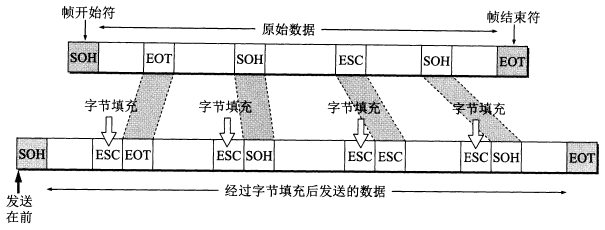
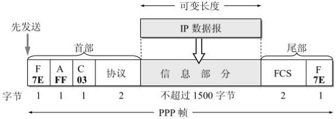
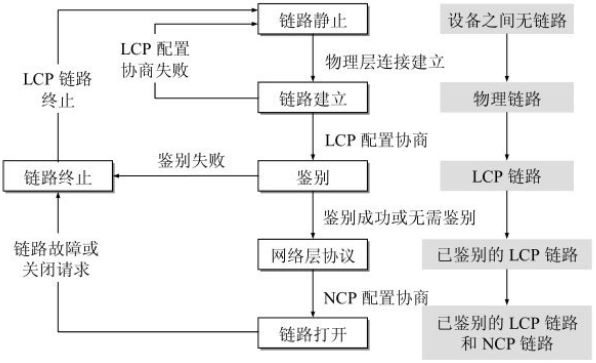

## 一些概念
* 链路 (link)
  > 即连接两个相邻节点的一段**物理线路**，可以是有线或无线。        
    两台计算机通信时，数据一般都要通过多条这样的链路。

* 数据链路 (data link)
  > 也叫逻辑链路，就是在物理线路的基础上，使用特定的通信协议来处理数据的传输。

* 帧
  > 数据链路层的一个重要工作就是：把网络层交下来的数据加工成**帧**，以及把接收到的帧中的数据取出交给网络层。   
  

## 点对点信道的主要工作流程
1. 节点 A 的数据链路层把网络层交下来的 IP 数据报添加首部和尾部标记加工成帧。
2. 节点 A 把帧发送给节点 B 的数据链路层。
3. 节点 B 的数据链路层收到帧后，如果检查没有出现差错，就从帧中提取出 IP 数据包上交给网络层；否则将帧丢弃。

## 数据链路层的三个基本问题：封装成帧、透明传输、差错检测

### 1. 封装成帧(framing)
就是在一段数据的头部和尾部分别添加标记，这样就构成了一个帧。   
接收端在收到物理层上交的比特流后，可以通过这个头尾部的标记，来辨别一个帧的开始与结束。   
帧的头部与尾部的一个重要的作用就是进行**帧定界**(用来确定一个帧的边界)。  

在帧的头部与尾部中，记录了必要的控制信息。具体格式由具体的数据链路层协议决定。   
一般帧的头尾部长度是固定的，帧的数据部分在一个帧中的占比越大，那么传输的效率就越高。但是每一个数据链路层协议都规定能都传输额度帧中**数据部分的长度上限——最大传输单元 MTU (Maximun Transfer Unit)**。

当传输的数据是可以直接打印的 ASCII 码文本时，帧的头尾部会使用 ASCII 码中的两个控制字符作为特殊的**帧定界符**。   
放在帧头的叫做 **SOH (Start Of Header)**，放在帧尾的叫做 **EOT (End Of Transmission)**。   
SOH 的十六进制编码是 01，二进制编码是 00000001；   
EOT 的十六进制编码是 04，二进制编码是 00000100；   

### 2. 透明传输
由于使用了控制字符作为帧定界符，因此，数据部分一定不能出现与帧定界符相同编码的数据，否则得到的帧就不是我们希望的样子。    
如果传输的内容是纯 ASCII 码文本时，并不会出现这个问题，但网络上传输的东西的多样的。   
回到传输透明这个概念上，这里的**透明**指的就是在数据链路层上传输帧时，可以无视掉数据部分中的控制字符，保证帧可以被正确的送到目的地。   
解决办法就是，在数据部分中出现的 "SOH" 与 "EOT" 的前面插入一个**转义字符** "ESC，"ESC" 的十六进制编码是 1B，二进制编码是 00011011。如果要传输的数据中存在转义字符，那就在前面再插入一个转义字符。   
这种方法叫做 **字节填充** (byte stuffing) 或 **字符填充** (character stuffing)。   

### 3. 差错检查
数据在物理链路中传输时，总不会是理想的，数据中的某一比特，到达时可能会与发送时不一样。这就叫做**比特差错**。   
传输错误的比特与传输比特总数的比值叫做 **误码率 BER (Bit Error Rate)**。   
目前广泛使用的差错检查方法叫做 **循环冗余检验 CRC (Cyclic Redundancy Check)**。   
CRC 的算法流程如下:   

* 双方首先约定一个除数 P, 这里假设 P = 1101；  
* 发送方的工作：   
  * 假设现在准备发送数据 M，M = 101001, 先在 M 的末尾补 n 个 0，n = P 的位数 - 1；   
  * 然后用这个补 0 后的 M 与 P 进行**模 2 除法**运算，算到最后得到余数 R；   
  * 这个 R 叫做帧检验序列 FCS (Frame Check Sequence)，将 M + R 就能得到最后要发送的数据 101001001；   
* 接收方的工作：
  * 在收到数据 101001001 后，使用双方约定好的除数 P, 对数据进行 **模 2 除法** 运算，如果传输过程没有出现差错，最后的余数必定为 0；
  * 校验数据没错，就接收；错了就丢弃；

值得注意的是，CRC 算法，只能够保证接收到的帧是没有错误的，无法保证 **”可靠传输“**，因为在传输发送的过程中，帧可能会丢失，或重复发送，或顺序错误，这些属于 **传输差错**。发现并改正这些错误，由运输层的 TCP 协议来完成。

## 点对点协议 PPP
在通信线路质量较差的远古时代，数据链路层中也存在处理传输差错实现可靠传输的协议，叫做**高级数据链路控制 HDLC (High-Level Data Link Control)**，但现在已经基本不用了，对于点对点的链路，较多是用更加简单的**点对点协议 PPP (Point-to-Point Protocol)**。

### PPP 协议的特点
PPP 协议是互联网用户与 ISP 之间通信使用的协议。    

#### PPP 协议应满足的需求：
1. 简单
   > 数据链路层的帧，不需要纠错，不需要序号，不需要流量控制，这些都由网络层的 TCP/IP 协议处理。   
    对于错误的检查仅需要使用 CRC 算法校验，没错误就接收，否则就丢弃，其他什么也不做。   

2. 封装成帧
   > 使用**帧定界符**

3. 透明性
   > 透明传输

4. 多种网络层协议
   > 能够在同一条物理链路上支持多种网络层协议的运行。

5. 多种类型链路
   > 能够在任意类型的链路上运行。

6. 差错检测
   
7. 检测链接状态

8. 最大传输单元

9.  网络层地址协商
    > PPP协议必须提供一种机制使通信的两个网络层（例如，两个IP层）的实体能够通过协商知道或能够配置彼此的网络层地址。

10. 数据压缩协商
    > PPP协议必须提供一种方法来协商使用数据压缩算法。但PPP协议并不要求将数据压缩算法进行标准化。

#### PPP 协议的组成
三个部分：
1. 一个将IP数据报封装到串行链路的方法。
2. 一个用来建立、配置和测试数据链路连接的链路控制协议LCP (Link Control Protocol)。通信的双方可协商一些选项。
3. 一套**网络控制协议NCP (Network Control Protocol)**，其中的每一个协议支持不同的网络层协议，如IP、OSI的网络层、DECnet，以及AppleTalk等。

### PPP 协议的帧格式
 
PPP 帧使用 0x7E 作为帧定界符，记录在**标志字段 F (flag)**，也就是首部的第一个字段和尾部的第二个字段。    
在首部中的**地址字段 A** 与**控制字段 C**，在最初定制协议的时考虑以后再对他们的值进行其他的定义，但至今也没有给出，所以这两个字段是无意义的。   
首部中最后一个字段，**协议字段**，用来记录**信息字段**所使用的协议。
  > 当协议字段的值为 0x0021 时，信息字段就是 IP 数据报；  
    值为 0xC021 时，信息字段是 **PPP 链路控制协议 LCP** 的数据；   
    ...

信息字段的长度可变，但最大值为 1500 个字节。

尾部中的第一个字段记录 CRC 算法的帧检验序列 FCS。

使用了 0x7D 作为转义字符进行字节填充。

## PPP 协议的工作状态和基本流程

在最开始俩端设备为创建连接时，PPP 协议处在 **“链路静止” (Linked Dead)** 状态。   

当用户发起PPPoE拨号上网登录请求后，调制解调器就会通知路由器建立物理连接，物理连接创建后，PPP 协议进入 “链路建立” (Linked Establish) 状态。

紧接着双方使用 LCP 协议开始协商一些 **配置选项**，即发送 LCP 协议的 **配置请求帧 (Configure-Request)**， 这是一个 PPP 帧，其协议字段是 0xC021，信息字段是配置请求。   
链路的另一端可以回复下面几种响应中的一种:   
* 配置确认帧(Configure-Ack)：所有选项都接受。
* 配置否认帧(Configure-Nak)：所有选项都理解但不能接受。
* 配置拒绝帧(Configure-Reject)：选项有的无法识别或不能接受，需要协商。    

这些配置选项包括链路上的最大帧长、所使用的鉴别协议等等。   

协商结束后，PPP 协议就进入下一个状态 **“鉴别” (Authenticate)**，在这一状态，只允许传送 LCP 协议的分组、鉴别协议的分组以及监测链路质量的分组。若使用口令鉴别协议 PAP (Password Authentication Protocol)，则需要发起通信的一方发送身份标识符和口令。
用户身份鉴别如果成功，进入 **“网络层协议”(Network-Layer Protocol)** 状态，双方可以开始进行网络层协议的通信；    
否则进入到 **“链路终止” (LinkTerminate)** 状态；

在 **“网络层协议“** 状态中，通信双方的网络层能够使用任意的网络层协议进行通信，只需要在 PPP 帧的协议字段上对应的值就可以了。    
这时候初次建立连接的网络层也需要进行一些配置相关的工作。

当网络层配置完成后，PPP 协议就进入到 **”链路打开“ (Linked Open)** 状态。     
链路的两个 PPP 端点可以彼此向对方发送分组。两个 PPP 端点还可发送回送请求 LCP 分组 (Echo-Request) 和回送回答 LCP 分组 (Echo-Reply)，以检查链路的状态。

当数据传输结束后，连接的任意一方都可以发出**终止请求** LCP 分组 (Terminate-Request) 请求终止链路连接，再对发出**终止确认** LCP 分组 (Terminate-Ack)后，PPP 协议转入到 **”链路终止“**。

当用户的调制解调器停止工作，回到 **”链路静止“** 状态。
