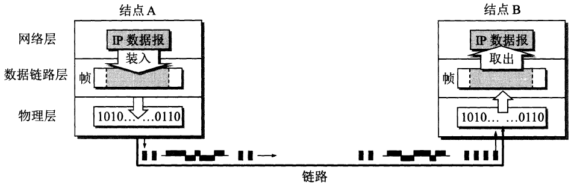
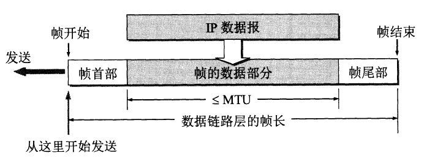
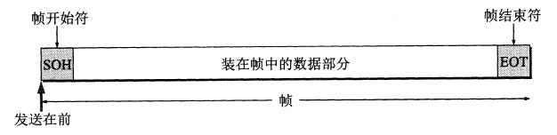

## 一些概念
* 链路 (link)
  > 即连接两个相邻节点的一段**物理线路**，可以是有线或无线。        
    两台计算机通信时，数据一般都要通过多条这样的链路。

* 数据链路 (data link)
  > 也叫逻辑链路，就是在物理线路的基础上，使用特定的通信协议来处理数据的传输。

* 帧
  > 数据链路层的一个重要工作就是：把网络层交下来的数据加工成**帧**，以及把接收到的帧中的数据取出交给网络层。   
  

## 点对点信道的主要工作流程
1. 节点 A 的数据链路层把网络层交下来的 IP 数据报添加首部和尾部标记加工成帧。
2. 节点 A 把帧发送给节点 B 的数据链路层。
3. 节点 B 的数据链路层收到帧后，如果检查没有出现差错，就从帧中提取出 IP 数据包上交给网络层；否则将帧丢弃。

## 数据链路层的三个基本问题：封装成帧、透明传输、差错检测

**封装成帧(framing)** 就是在一段数据的头部和尾部分别添加标记，这样就构成了一个帧。   
接收端在收到物理层上交的比特流后，可以通过这个头尾部的标记，来辨别一个帧的开始与结束。   
帧的头部与尾部的一个重要的作用就是进行**帧定界**(用来确定一个帧的边界)。  

在帧的头部与尾部中，记录了必要的控制信息。具体格式由具体的数据链路层协议决定。   
一般帧的头尾部长度是固定的，帧的数据部分在一个帧中的占比越大，那么传输的效率就越高。但是每一个数据链路层协议都规定能都传输额度帧中**数据部分的长度上限——最大传输单元 MTU (Maximun Transfer Unit)**。

当传输的数据是可以直接打印的 ASCII 码文本时，帧的头尾部会使用 ASCII 码中的两个控制字符作为特殊的**帧定界符**。   
放在帧头的叫做 **SOH (Start Of Header)**，放在帧尾的叫做 **EOT (End Of Transmission)**。   
SOH 的十六进制编码是 01，二进制编码是 00000001；   
EOT 的十六进制编码是 04，二进制编码是 00000100；   

